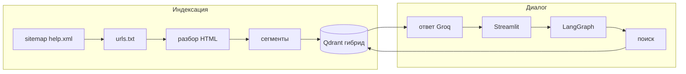

# Т-Банк Help RAG


Чат-ассистент на базе **Streamlit** и **LangGraph**: ответы по **публичным страницам справки Т-Банка**, собранным по карте сайта (**sitemap**), с **гибридным поиском** (векторный + полнотекстовый BM25) в **Qdrant** и генерацией текста через **Groq**.

---

## Назначение

Система загружает список адресов справочных разделов (банк, бизнес, инвестиции, страхование и др.), извлекает текст со страниц, разбивает на смысловые сегменты, индексирует их в векторной базе и в диалоге выдаёт ответ **по найденным фрагментам** с указанием **исходных URL**. Веса языковой модели **не дообучаются** на материалах банка — используется поиск по индексу и генерация ответа по контексту.

Охват данных ограничен **разделами справки** из карты сайта; отдельный сбор новостных лент или RSS в состав решения не входит.

---

## Возможности

- Источник знаний: публичные страницы справки из официальной карты сайта
- Поиск: сочетание семантического отбора и полнотекстового ранжирования (BM25)
- Хранение векторов и индексов: **Qdrant**
- Генерация ответа: **Groq**
- Сценарий диалога: **LangGraph**
- Веб-интерфейс: **Streamlit**
- К ответу прикладываются ссылки на страницы-источники

---

## Содержание

- [Архитектура](#архитектура)
- [Стек](#стек)
- [Требования](#требования)
- [Установка и запуск](#установка-и-запуск)
- [Docker](#docker)
- [Переменные окружения](#переменные-окружения)
- [Структура проекта](#структура-проекта)
- [Ограничения](#ограничения)
- [Правовая информация](#правовая-информация)

---

## Архитектура



**Цепочка в LangGraph** (`src/rag/graph.py`):

1. **Поиск** — уточнение формулировки последнего вопроса с учётом истории (языковая модель) и выборка до K наиболее релевантных сегментов из Qdrant.
2. **Ответ** — системные правила (опора только на переданный контекст, фиксированный ответ при отсутствии данных) и генерация текста с перечислением источников.

Учёт контекста беседы: `MemorySaver` и идентификатор сессии из Streamlit.

---

## Стек

| Компонент | Технология |
| --------- | ---------- |
| Интерфейс | Streamlit |
| Сценарий и цепочка вызовов | LangGraph, LangChain |
| Языковая модель | Groq (`langchain-groq`, по умолчанию `llama-3.3-70b-versatile`) |
| Векторное хранилище | Qdrant (`langchain-qdrant`, гибридный режим) |
| Векторизация текста | Hugging Face, модель `BAAI/bge-m3` |
| Полнотекстовый компонент | BM25 (`FastEmbedSparse`) |
| Загрузка и разбор страниц | `requests`, BeautifulSoup |

---

## Требования

- **Python 3.12+** (см. `Dockerfile`)
- Ключ доступа к **Groq**: [console.groq.com](https://console.groq.com/)
- **Qdrant** — в контейнере (Docker) либо в файловом режиме на диске (`QDRANT_PATH` в `.env`)
- Сеть при первом запуске: загрузка моделей с Hugging Face, обращения к сайту при индексации

---

## Установка и запуск

Перейдите в корень проекта.

### 1) Окружение и зависимости

**Windows (PowerShell):**

```powershell
python -m venv .venv
.\.venv\Scripts\Activate.ps1
pip install -r requirements.txt
Copy-Item .env.example .env
# задайте как минимум GROQ_API_KEY
```

**macOS / Linux:**

```bash
python -m venv .venv
source .venv/bin/activate
pip install -r requirements.txt
cp .env.example .env
```

### 2) Qdrant

**Вариант A — Docker:**

```bash
docker compose up -d qdrant
```

**Вариант B — файловый режим:** в `.env` укажите `QDRANT_PATH` (например `./qdrant_storage`), см. `.env.example`.

### 3) Адреса страниц и индексация

Файл `src/rag/urls.txt` при сборке создаётся локально и в репозиторий не входит.

```bash
python -m src.rag.parse_sitemap
python -m src.rag.run_indexing
```

Первый запуск может занять продолжительное время (загрузка модели векторизации, обход большого числа страниц). Чтобы ограничить число страниц, задайте в `.env` переменную `RAG_MAX_PAGES` (например `20`).

### 4) Запуск интерфейса

```bash
streamlit run app.py
```

Адрес в браузере будет показан в консоли (часто `http://localhost:8501`).

---

## Docker

Подъём Qdrant и приложения (нужен заполненный `.env`, в т.ч. `GROQ_API_KEY`):

```bash
docker compose up --build
```

Приложение доступно на порту **8501**.

Индексацию перед первым использованием контейнера с приложением выполните на машине с доступом к Qdrant: `python -m src.rag.run_indexing` при `QDRANT_HOST=localhost` (или адресе сервиса Qdrant в вашей сети).

---

## Переменные окружения

Шаблон и пояснения — в **`.env.example`**.

| Переменная | Назначение |
| ---------- | ---------- |
| `GROQ_API_KEY` | Ключ Groq (обязателен для работы чата) |
| `GROQ_MODEL` | Идентификатор модели в Groq |
| `QDRANT_HOST` / `QDRANT_PORT` | Подключение к Qdrant по сети |
| `QDRANT_PATH` | Каталог для файлового режима Qdrant |
| `QDRANT_COLLECTION` | Имя коллекции (по умолчанию `tbank_faq`) |
| `EMBEDDING_MODEL` | Модель векторизации на Hugging Face |
| `RAG_FINAL_K` | Число сегментов в контексте ответа |
| `RAG_MAX_PAGES` | Верхняя граница числа страниц при индексации (необязательно) |

---

## Структура проекта

```text
.
├── app.py                      # интерфейс Streamlit
├── requirements.txt
├── Dockerfile
├── docker-compose.yml
├── .env.example
├── src/
│   ├── state.py                # состояние графа (TypedDict)
│   └── rag/
│       ├── config.py           # Qdrant, векторизация
│       ├── parse_sitemap.py    # получение URL из sitemap
│       ├── run_indexing.py     # urls.txt → Qdrant
│       ├── indexer.py          # HTTP, разметка, сегментация
│       ├── retriever.py        # гибридный поиск
│       ├── debug_retrieval.py  # диагностика поиска
│       └── graph.py            # LangGraph, промпты
└── README.md
```

---

## Ограничения

- Полнота и точность ответов зависят от состава проиндексированных страниц и актуальности справочного материала на сайте банка.
- Номер телефона поддержки и формулировки в логике ответа задаются в коде и **не заменяют** официальные каналы обслуживания Т-Банка.

---

## Правовая информация

Решение **не связано** с АО «ТБанк» и **не является** официальным сервисом банка. Товарные знаки и тексты страниц принадлежат их правообладателям. При автоматизированной загрузке страниц с сайта соблюдайте условия использования ресурса и требования применимого законодательства.
