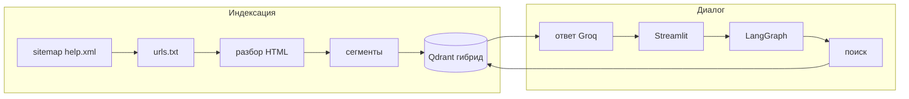

# Ассистент справки Т-Банка (RAG)


Чат по **публичным страницам справки Т-Банка**: индексация по **sitemap**, **гибридный поиск** (вектор + BM25) в **Qdrant**, ответы через **LangGraph** и **Groq**, интерфейс **Streamlit**.  
Проект сделан в рамках **хакатона / учебного спринта** с ограничением по времени; репозиторий оформлен как **портфельная версия** с полной инструкцией воспроизведения.

---

## Демо

| Материал | Файл в репозитории |
| -------- | ------------------ |
| **Видео демо** | [`docs/demo/demo.mp4`](docs/demo/demo.mp4) |
| **Презентация (PDF)** | [`docs/presentation/slides.pdf`](docs/presentation/slides.pdf) |
| **Превью GIF** | _не добавлено — при желании положите `docs/demo/preview.gif`_ |

На GitHub файл `demo.mp4` открывается как ссылка на скачивание; для просмотра в браузере можно выложить копию на YouTube / VK Video и добавить URL сюда.

---

## Что делает проект

| Этап | Содержание |
| ---- | ---------- |
| **База знаний** | URL из официальной **карты сайта** справки → загрузка HTML → сегменты (`parse_sitemap`, `indexer`). |
| **Поиск** | **Гибридный** Qdrant: эмбеддинги (`BAAI/bge-m3`) + **BM25** (`retriever.py`). |
| **Генерация** | **LangGraph** (`graph.py`): top‑K сегментов → **Groq** LLM, ответ только по контексту. |
| **Проверка / ограничения** | Системный промпт: только факты из контекста; при отсутствии данных — **фиксированный отказ** (шаблон в коде). Отдельного компилятора Lua в проекте **нет**. |
| **Интерфейс** | **Streamlit** (`app.py`): чат + блок **«Источники»** с URL страниц. |

Веса модели **не дообучаются** на материалах банка — только retrieval + генерация в контексте.

---

## Почему проект интересен

- **RAG по реальному домену**: корпус с публичной справки, а не синтетический CSV.
- **Гибридный retrieval**: семантика + лексика (BM25) — удобно при жаргоне и точных формулировках.
- **Явный граф LangGraph**: узлы поиска и ответа разделены; проще расширять, чем один скрипт.
- **Воспроизводимая поставка**: Docker Compose, `.env.example`, зафиксированные зависимости в `requirements.txt`.
- **Итерация в диалоге**: переформулирование последнего вопроса с учётом истории перед поиском (`_rewrite_query` в `graph.py`) — одна логическая итерация «уточнения запроса».
- **Хакатонный контур**: сквозной путь ingest → индекс → UI за ограниченное время; ниже — честные ограничения.

---

## Контекст хакатона

Репозиторий подготовлен для **публичной сдачи** (ссылка жюри, демо, презентация).  
Код — **не официальный продукт Т-Банка** и не сервис поддержки.  
В разделе **«Материалы хакатона»** в `<details>` вынесены **организационные требования** и текст правил, который вы передали для README; сверяйте их с фактической реализацией этого репозитория (стек Groq + RAG).

---

## Архитектура



**Цепочка (кратко)**

- **Ingest** — sitemap → список URL → HTTP → чанки → Qdrant (вектор + sparse).
- **Retrieve** — переформулирование запроса с учётом истории (при необходимости) → гибридный top‑K.
- **Generate** — промпт с правилами и блоком `<context>` → ответ + список источников.
- **Validate (мягко)** — правила в промпте и шаблон при пустом/недостаточном контексте; **не** статический анализатор Lua и **не** локальный Ollama.
- **Refine** — LLM-переформулирование последнего вопроса для поиска (см. `graph.py`).
- **Serve** — `streamlit run app.py`, в Docker порт **8501**.

> **C4:** для хакатона часто требуют диаграмму C4. Здесь дан обзорный mermaid; при необходимости добавьте отдельный `docs/architecture-c4.md` с уровнями Context / Container / Component — в коде это не генерировалось автоматически.

---

## Основные возможности

- Загрузка URL из sitemap (`src/rag/parse_sitemap.py`)
- Ограничение числа страниц при индексации (`RAG_MAX_PAGES` в `.env`)
- Гибридный поиск в Qdrant (`src/rag/retriever.py`)
- Сценарий LangGraph + память (`MemorySaver`, thread id)
- UI Streamlit с раскрываемыми источниками
- Скрипт диагностики поиска (`src/rag/debug_retrieval.py`)
- `docker-compose`: Qdrant + приложение, том под кэш Hugging Face

---

## Быстрый старт

1. `python -m venv .venv` → активация → `pip install -r requirements.txt`
2. Скопировать `.env.example` → `.env`, задать **`GROQ_API_KEY`**
3. Поднять Qdrant: `docker compose up -d qdrant` **или** режим `QDRANT_PATH` в `.env`
4. `python -m src.rag.parse_sitemap` и `python -m src.rag.run_indexing`
5. `streamlit run app.py` → в браузере адрес из консоли (часто `http://localhost:8501`)

---

## Подробная установка и запуск

### Требования

- **Python 3.12+** (см. `Dockerfile`)
- Ключ **Groq**: [console.groq.com](https://console.groq.com/)
- **Qdrant** — контейнер из `docker-compose.yml` или файловый каталог (`QDRANT_PATH`)
- Сеть при первом запуске: загрузка моделей с Hugging Face, HTTP при индексации

### 1) Окружение и зависимости

**Windows (PowerShell)**

```powershell
python -m venv .venv
.\.venv\Scripts\Activate.ps1
pip install -r requirements.txt
Copy-Item .env.example .env
# задайте как минимум GROQ_API_KEY
```

**macOS / Linux**

```bash
python -m venv .venv
source .venv/bin/activate
pip install -r requirements.txt
cp .env.example .env
```

### 2) Qdrant

**Вариант A — Docker**

```bash
docker compose up -d qdrant
```

**Вариант B — файловый режим** — задайте `QDRANT_PATH` в `.env` (см. комментарии в `.env.example`).

### 3) Список URL и индексация

Файл `src/rag/urls.txt` создаётся локально и **в репозиторий не коммитится** (см. `.gitignore`).

```bash
python -m src.rag.parse_sitemap
python -m src.rag.run_indexing
```

Первый запуск может быть долгим. Для быстрой проверки задайте в `.env` **`RAG_MAX_PAGES=20`** (или другое число).

### 4) Запуск интерфейса

```bash
streamlit run app.py
```

### Docker (Qdrant + приложение)

Нужен заполненный `.env` (в т.ч. `GROQ_API_KEY`):

```bash
docker compose up --build
```

Приложение на порту **8501**. Индексацию перед первым использованием выполните с машины, где доступен Qdrant (см. `QDRANT_HOST` в `.env`).

### Однострочный запуск (после первичной подготовки)

Жюри может ожидать одну команду. После создания `.env` и первичной индексации:

```bash
docker compose up --build
```

Для **чистого** клона без готовой коллекции Qdrant одной командой недостаточно — сначала нужны шаги `parse_sitemap` и `run_indexing` (см. выше). Их можно обернуть в свой `Makefile` / скрипт `scripts/bootstrap.sh` при желании.

---

## Интерфейс и API

В репозитории **нет отдельного REST/FastAPI** и нет OpenAPI для чата: пользовательский контур — **только Streamlit** (`streamlit run app.py` или сервис `app` в Compose на **8501**).

---

## Структура проекта

```text
.
├── app.py
├── requirements.txt
├── Dockerfile
├── docker-compose.yml
├── .env.example
├── docs/
│   ├── demo/
│   │   └── demo.mp4              # демо-видео для жюри
│   └── presentation/
│       └── slides.pdf            # презентация
├── src/
│   ├── state.py
│   └── rag/
│       ├── config.py
│       ├── parse_sitemap.py
│       ├── run_indexing.py
│       ├── indexer.py
│       ├── retriever.py
│       ├── debug_retrieval.py
│       └── graph.py
└── README.md
```

---

## Переменные окружения

Шаблон и пояснения — **`.env.example`**.

| Переменная | Назначение |
| ---------- | ---------- |
| `GROQ_API_KEY` | Ключ Groq (обязателен для чата) |
| `GROQ_MODEL` | Идентификатор модели в Groq |
| `QDRANT_HOST` / `QDRANT_PORT` | Сетевой Qdrant |
| `QDRANT_PATH` | Каталог для файлового режима Qdrant |
| `QDRANT_COLLECTION` | Имя коллекции (по умолчанию `tbank_faq`) |
| `EMBEDDING_MODEL` | Модель эмбеддингов на Hugging Face |
| `RAG_FINAL_K` | Число сегментов в контексте ответа |
| `RAG_MAX_PAGES` | Верхняя граница числа страниц при индексации (необязательно) |

---

## Ограничения

- Качество ответов зависит от состава проиндексированных страниц и актуальности справки на сайте банка.
- **Groq** — внешний API; запросы и ключ уходят к провайдеру по их правилам (это **не** полностью автономный локальный LLM в духе Ollama).
- Номер поддержки и формулировки в коде **не заменяют** официальные каналы Т-Банка.
- Тексты интерфейса и промптов частично на русском; бейджи и часть README могут быть на английском для GitHub.

---

## Материалы хакатона

<details>
<summary>Требования к README (сжатая версия правил) и примечание о соответствии</summary>

### Важно про соответствие

Ниже приведён **текст требований**, который вы передали для включения в README (Lua, Ollama, 8 GB VRAM, запрет внешних API и т.д.).

**Фактическая реализация этого репозитория** — RAG по публичной справке с **Groq API**, **Qdrant**, **Streamlit**, **LangGraph**. Это **не** генерация Lua через локальный Ollama и **не** проверка Lua-синтаксиса компилятором.

Если жюри оценивает **именно** чеклист ниже, уточните у организаторов: либо нужен **отдельный репозиторий** под кейс Lua+Ollama, либо явное разрешение подавать данный RAG-проект в другой номинации.

---

### Ограничения и требования (текст правил)

* Решение должно **локально** генерировать **Lua-код** по запросу на естественном языке.
* Использовать можно только **open-source LLM**, запускаемую **локально через Ollama**.
* **Внешние AI API** (OpenAI, Anthropic и др.) в runtime **запрещены**.
* Модель должна работать на **GPU 8 GB VRAM** **без CPU offload**.
* Параметры проверки фиксированы: `num_ctx=4096`, `num_predict=256`, `batch=1`, `parallel=1`.
* Пиковое потребление памяти: **не более 8.0 GB VRAM**.
* В README нужно указать точный `ollama pull <tag>` и параметры запуска.
* Система должна:

  * понимать запрос на русском или английском;
  * генерировать рабочий Lua-код;
  * поддерживать хотя бы **одну итерацию уточнения/доработки**;
  * выполнять **валидацию результата** (синтаксис, тесты, статический анализ или шаблонные проверки).
* Все зависимости, модели и шаги запуска должны быть описаны так, чтобы жюри могло **полностью воспроизвести** решение.
* Если используются база знаний, retrieval или шаблоны, они должны быть **локальными**, входить в поставку и быть описаны в инструкции.

### Что нужно сдать

* Ссылку на **открытый репозиторий** с исходным кодом и инструкцией по запуску.
* Желательно предусмотреть запуск через **Docker / docker-compose**.
* Должен быть **однострочный запуск** всего решения.
* **Архитектуру в нотации C4**.
* **Демо-видео**.
* **Презентацию проекта** с объяснением соответствия требованиям безопасности и ограничений по ресурсам.

### Критерии оценки

* **Качество и корректность Lua-кода** — 0–50 баллов.
* **Агентность и качество итераций** — 0–25 баллов.
* **Локальность, приватность и воспроизводимость** — 0–25 баллов.

---

**TODO (заполнить вручную):** ссылка на задание трека, дедлайн, чат организаторов, Devpost — если можно публиковать.

</details>

---

## Отказ от ответственности

Проект **не связан** с АО «ТБанк» и **не является** официальным сервисом банка. Товарные знаки и тексты страниц принадлежат их правообладателям. При автоматизированной загрузке страниц соблюдайте условия использования ресурса и применимое законодательство. Ответы модели носят **информационный** характер; для юридически значимых решений используйте официальные каналы банка.
